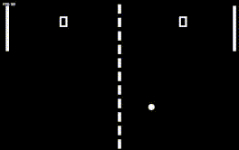

# Pong (1972) Clone — C++ / raylib

Simple two-player Pong clone built with C++ using raylib.



## 💡 Overview
Made as a small personal project to learn about raylib, and basic game logic.

## 🎮 Controls
- Left paddle: W / S  
- Right paddle: ↑ / ↓

## ✨ Features
- 2-player gameplay
- scoring
- Ball collision + adaptive speed

## 📦 Setup (Linux)
### Requirements
- g++ (C++ compiler)
- raylib libraries

### Build & Run
```bash
chmod +x build.sh
./build.sh
./build/pong
